## 목차

- [프로젝트 소개](#-프로젝트-소개)
- [기술 스택](#-기술-스택)
- [문서 및 아키텍쳐](#-문서-및-아키텍쳐)
- [주요 기능](#-주요-기능)
- [트러블슈팅/성능개선](#-트러블슈팅/성능개선)

## 🚀 프로젝트 소개
**온라인 주류예약픽업서비스**

### URL
- [eDrink24](https://edrink24.com)
  - 현재는 제공받던 aws계정이 만료되어 접속되지 않음
- [notion](https://www.notion.so/ysstudy/eDrink24-10102f7b13718062bbeed514d3dbe3dd)
  
### 선정배경
- 코로나 이후, 집에서 술을 즐기는 홈술 트렌드와 함께 다양한 주류에 대한 수요가 증가함
- 특히 편의점에서의 주류매출은 매년 증가하는 추세
- 기존의 편의점 웹, 어플리케이션 또한 주류 관련 서비스를 제공하고 있지만 일부 기능이기에 사용률이 저조함
- 따라서 기존 어플리케이션에서 분리해 차별화, 특수화된 서비스를 제공하여 특정 수요층의 수요를 만족시키고자 개발을 시작함
- 추가로 교육과정에서 배운 스킬들을 직접 활용하며 복기하고 고도화하기 위함

### 팀구성
- 4명
- [@Young5098](https://github.com/Young5097) / Front-end, Back-end, Infra
- [@giuk-kim2](https://github.com/giuk-kim2) / Front-end, Back-end
- [박관호] / Front-end, Back-end
- [오윤하] / Front-end, UI-UX

### 진행기간
- 2024/07/15 ~ 2024/08/29

## 🛠 기술 스택
- _**Git-flow**_ 브랜치 전략 사용
  - 개발 병렬화 및 운영환경에 대한 영향 최소화 목적
- IDE
  - Front-end :  _**VS Code**_
  - Back-end : _**Intellij**_
  - DB : _**MySQL Workbench**_
  - Deploy : _**AWS**_, _**Github Org**_, _**Docker Hub**_
  
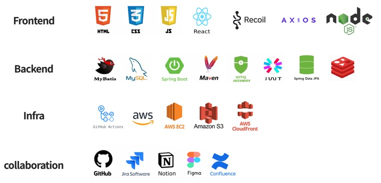

## 📝 핵심기능 및 목표
- **Rest API**를 기반으로 한 확장성, 재사용성이 높은 시스템, 개발환경 구축
- 사용자의 사용감을 고려한 UI 및 기능유도 설계
- **사용자의 위치에 기반한 단골매장 지정**
- **각 매장의 재고에 따른 서비스 분리**
  - 단골매장에 재고가 있으면 **'즉시픽업'**
  - 단골매장에 재고가 없으면 주문 후, 제품이 도착하면 픽업할 수 있는 **'예약픽업'**
    

## 🚧 문서 및 아키텍쳐
### 전체문서보기 
- https://www.figma.com/design/54eCHb4xmTtRgEeW8eJwWM/eDrink24?node-id=814-917&node-type=canvas&t=Ces7Nf1XzweQqDYN-0

### 요구사항정의서
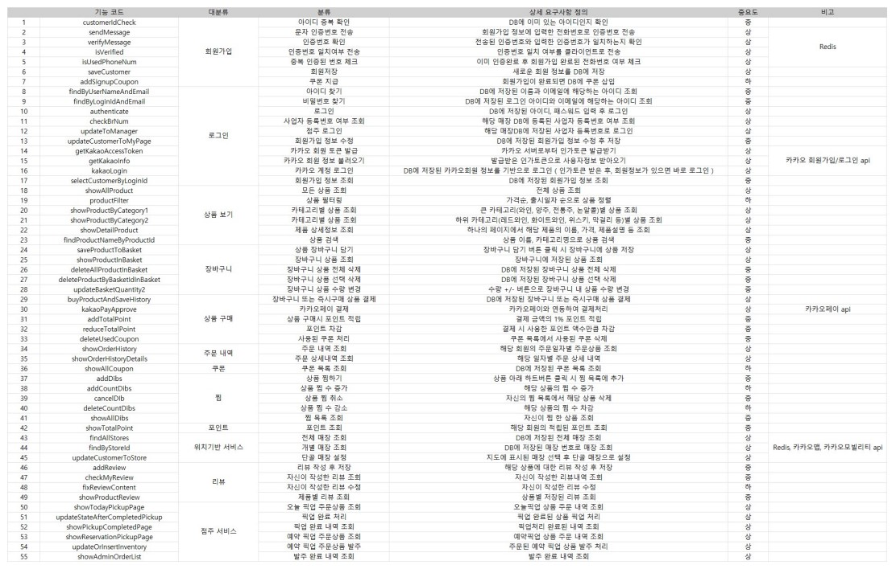

### API 정의서
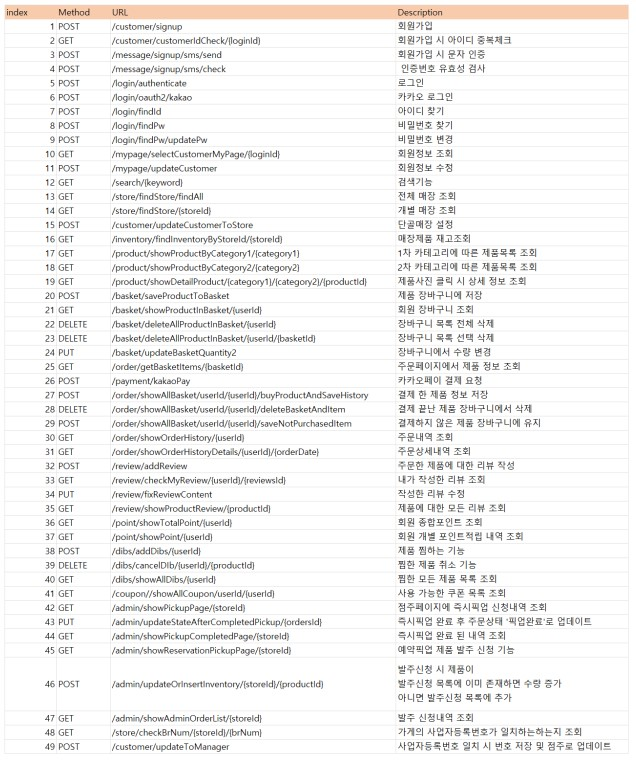

### ERD 다이어그램
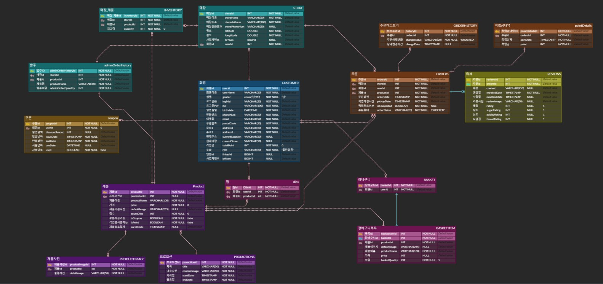

### UI 설계
- [UI - Figma](https://www.figma.com/design/54eCHb4xmTtRgEeW8eJwWM/eDrink24?node-id=0-1&node-type=canvas&t=Ces7Nf1XzweQqDYN-0)
- Figma를 통해 UI 설계 및 디자인을 우선 작업함
  
### 시스템 아키텍처
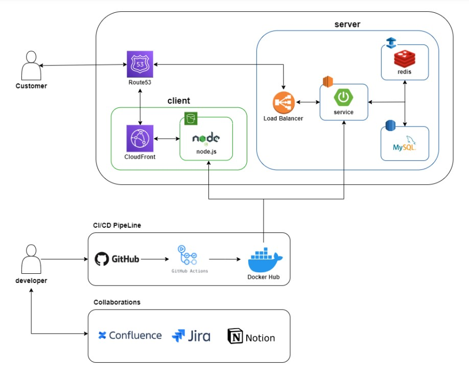

## 🌟 주요 기능
### 메인페이지
<table>
  <tr>
    <td></td>
    <td>
      
<Strong>설정된 현재위치 및 단골매장 이름</Strong>

      
- 현재위치 및 단골매장명을 보여줌

      
- 클릭 시, 단골매장설정 페이지로 이동

      
<Strong>오늘픽업 제품일부 보여주기</Strong>

      
- 설정한 단골매장에서 즉시픽업가능한 제품 일부를 보여줌 (로그인된 상태에서만)

    </td>
  </tr>
</table>

### 로그인, 회원가입 페이지 
<table>
  <tr>
    <td></td>
    <td>
      
<Strong>로그인 기능</Strong>

      
- <Strong>Spring Security</Strong> 기반 : 사용자인가 및 보안성 향상 목적

      
- ID/PW 입력 시, 로그인 되고 <Strong>JWT</Strong> 토큰을 발급받음

      
<Strong>ID/PW 찾기</Strong>

      
- ID찾기 : 이름, 이메일로 ID를 찾을 수 있음

      
- PW찾기 : 이름, ID를 통해 PW를 변경할 수 있음

      
<Strong>일반 회원가입</Strong>

      
- 일반 회원가입 페이지로 이동

      
<Strong>카카오 회원가입</Strong>

      
- <Strong>카카오API </Strong> 사용

      
- 카카오 계정을 통해 회원가입 가능. 추가정보 입력필요

      
- 이미 가입된 계정일 경우, 해당 페이지로 바로 로그인 가능

    </td>
  </tr>
  <tr>
    <td></td>
    <td>
      
<Strong>필요정보들을 입력 후, 회원가입을 완료할 수 있음</Strong>

      
<Strong>전화번호 인증</Strong>

      
- 주류서비스이므로 성인인증이 이루어져야하지만, 사업자번호가 없어 해당 API를 사용할 수 없어 문자인증으로 대체

      
- <Strong>Coolsms API</Strong>를 통해 문자인증을 구현. 인증번호는 랜덤 6자리가 발송됨

      
- 인증번호는 <Strong>Redis</Strong>의 Template에 <Strong>"전화번호":"인증번호"</Strong>로 저장되며, 3분의 유효시간 or 인증이 완료된 경우dp 삭제되도록함

      
<Strong>주소찾기</Strong>

      
- <Strong>카카오맵API</Strong>를 통해 주소를 찾은 후, 입력되도록 함

    </td>
  </tr>
</table>

### 마이페이지
<table>
  <tr>
    <td></td>
    <td>
      
<Strong>회원정보수정</Strong>

      
- 회원정보수정페이지로 이동 후, 수정가능

      
<Strong>포인트 및 쿠폰내역 확인모달</Strong>

      
- 포인트 적립내역을 확인가능

      
- 보유한 쿠폰목록를 확인가능. 사용된 쿠폰은 보이지않음

      
<Strong>찜페이지</Strong>

      
- 찜한 제품내역확인 가능

      
- 제거 및 장바구니, 주문을 즉시 가능

      
<Strong>'일반회원->점주' 전환기능</Strong>

      
- 사업자인증번호 입력을 통해 점주로의 계정업데이트 가능

      
- 매장마다 임의의 10자리 생성 후, 테이블에 추가해놓은 상태

      
<Strong>로그아웃 기능</Strong>

      
- 발급된 JWT 토큰을 삭제

    </td>
  </tr>
</table>

### 단골매장 설정페이지
<table>
  <tr>
    <td>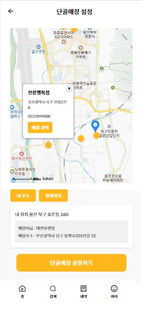</td>
    <td>
      
<Strong>Redis</Strong>를 통한 캐싱전략 이용 : API 응답속도 개선목적

      
<Strong>카카오맵 API</Strong> 이용

      
<Strong>위치설정</Strong>

      
- <Strong>Geolcation API</Strong> 이용

      
- '내 주소' 버튼 : 주소에 등록된 위치를 기반으로 지도를 보여줌

      
- '현재위치' 버튼 : 현재위치를 기준으로 지도를 보여줌

      
<Strong>매장 보여주기 및 설정하기</Strong>

      
- 현재 위치(지도 중앙점)을 기준으로 2km 내의 emart24의 위치를 마커로 표시

      
- 마커를 클릭하면 매장정보 확인가능

      
- '매장선택' 버튼 : 변경할 단골매장을 지정할 수 있음

      
- '단골매장 설정하기' 버튼 : 선택된 단골매장으로 변경됨

    </td>
  </tr>
</table>

### 카테고리 페이지
<table>
  <tr>
    <td>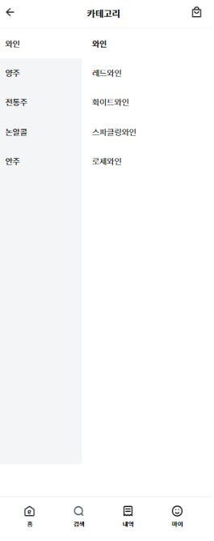</td>
    <td>
      
<Strong>카테고리를 통한 제품분류</Strong>

      
- 1차, 2차 카테고리를 통해 해당하는 제품들의 목록을 확인가능함

    </td>
  </tr>
</table>

### 제품목록, 제품상세페이지
<table>
  <tr>
    <td>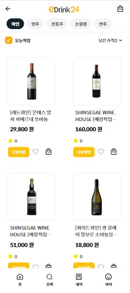</td>
    <td>
      
<Strong>제품목록</Strong>

      
- 카테고리를 통해 분류된 제품들을 확인할 수 있음

      
- 상단바를 통해 2차 카테고리 조건을 변경할 수 있음

      
- 각 제품카드를 클릭 시, 해당 제품의 상세페이지로 이동함

      
<Strong>오늘픽업</Strong>

      
- 제품카드에 오늘픽업 마크가 붙은 제품은 고객이 설정한 단골매장에 재고가 있는 상태

      
- 당일날, 즉시픽업이 가능한 제품임을 표시함

      
- '오늘픽업 체크박스' : 체크박스를 체크하면 즉시픽업 가능한 제품들만 보여줌

      
<Strong>제품평점</Strong>

      
- 리뷰의 평균평점을 제품카드에서 확인가능함

      
<Strong>장바구니, 찜버튼</Strong>

      
- 제품카드의 장바구니 버튼을 통해 장바구니에 담고 즉시 확인도 가능

      
- 찜버튼을 누르면 하트가 채워지며, 찜목록에 담김

    </td>
  </tr>
  <tr>
    <td>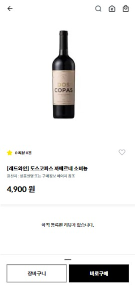</td>
    <td>
      
<Strong>평점 및 리뷰수를 통해 제품에 대한 평가정보를 고객에게 제공</Strong>

      
<Strong>제품 정보확인 가능</Strong>

      
<Strong>즉시구매 및 장바구니 기능</Strong>

      
- '즉시구매' : 주문페이지로 바로 이동

      
- '장바구니 담기' : 주문페이지로 바로 이동

      
<Strong>리뷰</Strong>

      
- 작성된 리뷰확인가능

    </td>
  </tr>
</table>

### 장바구니, 주문페이지
<table>
  <tr>
    <td>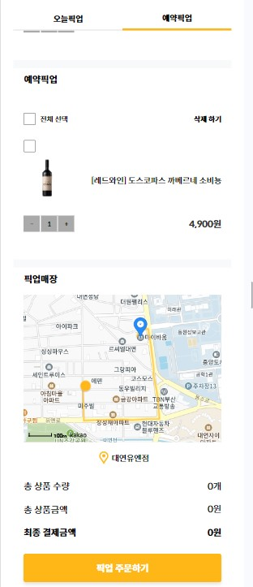</td>
    <td>
      
<Strong>장바구니 제품 확인가능</Strong>

      
- '오늘픽업'의 제품들 : 사용자 단골매장 기준으로 재고가 존재해, 즉시픽업이 가능한 제품목록

      
- '예약픽업'의 제품들 : 사용자 단골매장 기준으로 재고가 없어, 주문 후, 제품이 단골매장에 도착하면 픽업가능한 제품목록

      
<Strong>매장까지의 경로표시</Strong>

      
- <Strong>'카카오모빌리티 경로 API'</Strong> 이용

      
- 현재 위치에서 단골매장까지의 경로 표시

    </td>
  </tr>
    <tr>
    <td>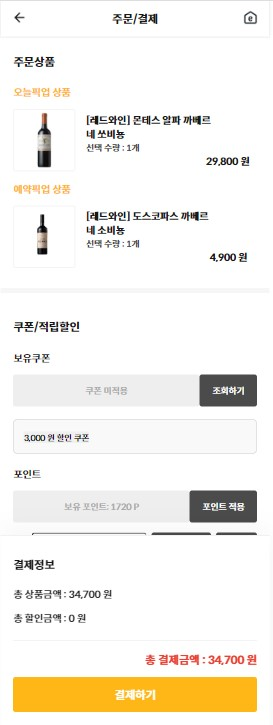</td>
    <td>
      
<Strong>쿠폰 기능</Strong>

      
<Strong>적립금 사용 기능</Strong>

      
- 사용금액 설정가능

      
<Strong>`카카오페이 API`</Strong>를 통한 결제서비스 구현

      
- 정상적으로 결제되면 주문완료, 제품 재고 차감

    </td>
  </tr>
</table>

### 주문목록, 주문상세, 리뷰작성페이지
<table>
  <tr>
    <td>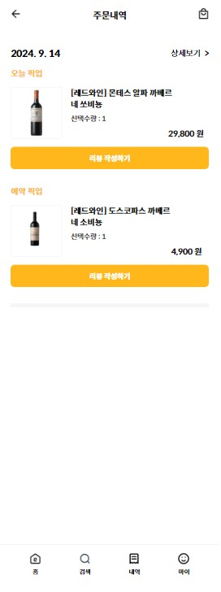</td>
    <td>
      
<Strong>주문내역 확인</Strong>

      
- 일자별로 주문한 제품을 확인가능

      
- 픽업완료 후, 리뷰작성가능

      
- 내역클릭 시, 주문상세내역으로 이동

    </td>
  </tr>
  <tr>
    <td>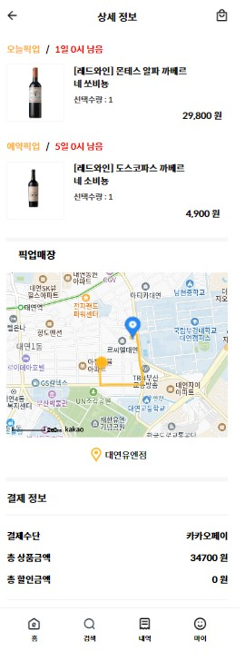</td>
    <td>
      
<Strong>주문상세내역 확인</Strong>

      
- 선택한 일자의 주문상세내역 확인가능

      
- 결제정보 확인가능

      
- <Strong>'카카오모빌리티 경로 API'</Strong> 이용

      
- 현재위치에서 픽업매장까지의 경로확인 가능

    </td>
  </tr>
    <tr>
    <td>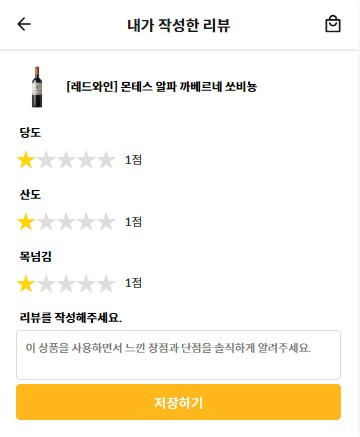</td>
    <td>
      
<Strong>3가지 평가지표</Strong>

      
- 픽업완료처리 된 경우, 리뷰작성가능

      
- 산도, 당도, 목넘김이란 3가지 지표의 1~5점까지의 평점 선택가능

      
- 3가지 점수의 평균을 평점으로 설정

      
<Strong>리뷰를 작성한 경우, '리뷰 작성 버튼' -> '리뷰 수정 버튼'으로 변경</Strong>

      
- 평점 및 리뷰 수정가능

    </td>
  </tr>
</table>

### 점주-발주페이지 ###
<table>
  <tr>
    <td>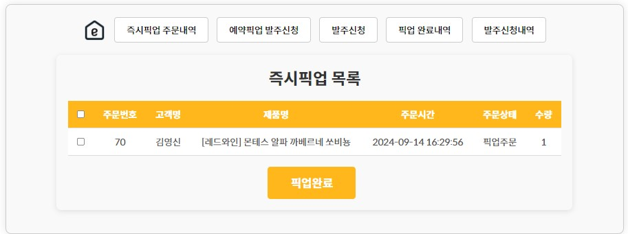</td>
    <td>
      
<Strong>즉시픽업주문내역</Strong>

      
- 즉시픽업 주문내역 확인 및 완료처리 가능

      
<Strong>예약픽업주문내역</Strong>

      
- 예약픽업 주문확인 가능

      
- 주문으로 인해 필요한 재고를 즉시 발주요청 가능하도록 처리

      
<Strong>발주신청</Strong>

      
- 제품목록을 확인하고 발주신청가능

      
<Strong>픽업완료내역 확인</Strong>

      
<Strong>발주신청내역 확인</Strong>

    </td>
  </tr>
</table>

## 📈 트러블슈팅/성능개선
### [Trouble Shooting/Front-end] 마커 랜더링 문제 / Young5097
- [[Trouble Shooting/Front-end] 마커 랜더링 문제](https://ysstudy.notion.site/Trouble-Shooting-Front-end-5c52987bd15f4e16b706a3a12bbdfcfd?pvs=4)
- React, Vanilla JS
- geolocation API

### [Trouble Shooting/Back-end] JPA 엔티티 변수명 자동변환문제 / Young5097
- [[Trouble Shooting/Back-end] JPA 엔티티 변수명 자동변환문제](https://ysstudy.notion.site/Trouble-Shooting-Back-end-JPA-10202f7b137180b9b4cad2794ae68246?pvs=4)
- SpringFramework, JPA

### [Trouble Shooting/Back-end] 카카오API-회원가입 문제 / Young5097
- [[Trouble Shooting/Back-end] 카카오API-회원가입 문제](https://ysstudy.notion.site/Trouble-Shooting-Back-end-API-10202f7b137180a98d3cd3484dcaf2cc?pvs=4)
- SpringFramework, React
- Kakao API

### [Trouble Shooting/Deploy] AWS RDS - MySQL 문제 / Young5097
- [[Trouble Shooting/Deploy] AWS RDS - MySQL 문제](https://ysstudy.notion.site/Trouble-Shooting-Deploy-AWS-RDS-MySQL-f72a4ff7569148f888521787d39c1748?pvs=4)
- AWS RDS, MySQL

### [Trouble Shooting/Deploy] http↔https 송수신문제 / Young5097
- [[Trouble Shooting/Deploy] http↔https 송수신문제](https://ysstudy.notion.site/Trouble-Shooting-Deploy-http-https-10202f7b137180c197d2e26cadd21a53?pvs=4)
- AWS ec2-LoadBalancer, AWS S3 Bucket-AWS CloudFront9

### [Trouble Shooting/Collaboration] 협업 문제
- [[Trouble Shooting/Collaboration] 협업 문제](https://ysstudy.notion.site/Trouble-Shooting-Collaboration-da1c9513d9734a908795c323d0d10ca5?pvs=4)

### [Performance/Back-end] sms 인증번호 개선 / Young5097
- [[Performance/Back-end] sms 인증번호 개선](https://ysstudy.notion.site/Performance-Back-end-sms-6250fa81e99f4275b787e5cf868c0790?pvs=4)
- SpringFramework, Redis
- CoolSms API

### [Performance/Back-end] Redis-Caching을 통한 API 응답속도 개선 / Young5097
- [[Performance/Back-end] Redis-Caching을 통한 API 응답속도 개선](https://ysstudy.notion.site/Performance-Back-end-Redis-Caching-API-a15ef757f8e7460c88ee5c615d2b6168?pvs=4)
- SpringFramework, Redis

  
## 🔍 평가

## ⚙ 보완점
### 1. 캐싱기능 확대
#### 📌문제상황
- 제품목록의 경우, 호출 횟수가 많아 DB 부하가 심할 가능성이 높음
- 현재 모든 제품을 한번에 랜더링하여 보여줌
#### 🛠 고안한 해결방법
1. 캐싱 DB를 활용해 속도개선 및 CRUD 횟수를 줄일 수 있음
2. 무한 스크롤을 도입하여, 한번에 랜더링 되는 데이터의 수를 줄이고 요청을 늘리는 방식
3. recoil이나 redux 등의 상태 관리 라이브러리를 통해 client에 제품데이터를 캐싱하는 방식
#### 👀 고려할 점
- 재고가 0이 될 경우, 캐싱스토리지엔 해당 부분이 변경되지 않은 상태 ( redis, redux 모두 해당 )
  - 주기적인 캐싱? or 특정 재고가 0이 될 때마다 다시 캐싱?
  - DB에서 재고가 0이 된 제품을 매번 Read를 하고 캐싱스토리지를 업데이트 하는게 효율적인가? => 주문처리 과정에서 재고가 0이 될 경우, 캐싱스토리지의 일치하는 데이터도 변경되도록 로직 설정
- 현재의 API 요청을 통해 데이터 불러오기 vs. 주문, 발주 시마다 캐싱스토리지를 업데이트 해야하는 캐싱
  - 결국 API 요청횟수는 감소하더라도, CRUD의 횟수는 오히려 증가할 수 있음 -> 오히려 캐싱스토리지를 운영하는게 더 많은 자원을 소비할 수도 있음

### 2. 동시성제어
#### 📌문제상황
- 3명의 사용자가 재고가 1개인 제품을 동시에 주문할 경우, 어떻게 될지 고려하지 않음
- 즉 동시성에 대한 고려가 이루어지지 않음
#### 🛠 고안한 해결방법
1. 낙관적 락, 비관적 락을 통해 하나의 트랜잭션만 처리하도록 제어 => 
2. lecture, redlock 라이브러리를 통해, redis를 활용한 메시지 큐잉방식을 통해 동시성 제어 => JVM 리소스를 사용하지 않아, 성능향상 기대가능
#### 👀 고려할 점
- 만약 3명이 주문을 동시에 걸고, 1명이 주문에 성공한다면 나머지 2명의 주문을 어떻게 처리해야할까?
  - 알림을 통해 실패할 경우, 장바구니로 redirect?
  - 사용자 편의성을 고려한 처리가 필요함
 
### 3. 찜버튼 부하문제
#### 📌문제상황
- 현재 찜버튼은 API를 통해 CRUD로 처리되고 있음
- 만약 그 요청횟수가 과해진다면 서버의 부하가 매우 심하게 발생할 가능성이 큼 => 테스트 필요
#### 🛠 고안한 해결방법
1. 비동기, 대용량 트래픽 처리에 강점을 가지는 kafka를 통한 안정적인 처리
2. Spring Batch를 통해, CRUD 횟수 자체를 줄이는 방법
#### 👀 고려할 점
- Spring batch의 경우, 찜 내역을 DB에 업데이트 하는데 주기가 존재
  - 사용자의 요청이 바로 적용이 되지 않는다는 의미
  - redis를 통해 캐싱하여, 사용자 입장에선 실시간으로 변경사항을 확인하도록하고 DB 자체엔 batch를 통해 업데이트 하는 방식
- kafka vs. redis+batch, 둘 중에 뭐가 더 뛰어난 성능을 보일까?
