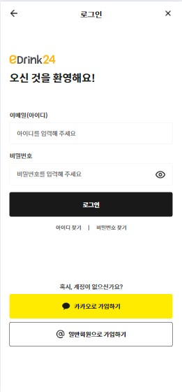
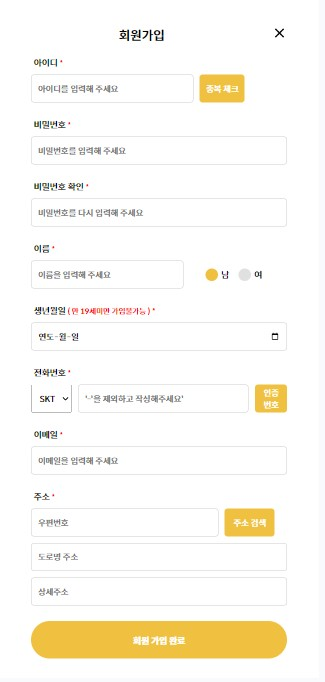

## 목차

- [프로젝트 소개](#-프로젝트-소개)
- [기술 스택](#-기술-스택)
- [문서 및 아키텍쳐](#-문서-및-아키텍쳐)
- [주요 기능](#-주요-기능)
- [트러블 슈팅](#-트러블-슈팅)

## 🚀 프로젝트 소개
**온라인 주류예약픽업서비스**

### URL
- [eDrink24](https://edrink24.com)
- 현재는 제공받던 aws계정이 만료되어 접속되지 않음..

### 선정배경
- 코로나 이후, 집에서 술을 즐기는 홈술 트렌드와 함께 다양한 주류에 대한 수요가 증가함
- 특히 편의점에서의 주류매출은 매년 증가하는 추세
- 기존의 편의점 웹, 어플리케이션 또한 주류 관련 서비스를 제공하고 있지만 일부 기능이기에 사용률이 저조함
- 따라서 기존 어플리케이션에서 분리해 차별화, 특수화된 서비스를 제공하여 특정 수요층의 수요를 만족시키고자 개발을 시작함
- 추가로 교육과정에서 배운 스킬들을 직접 활용하며 복기하고 고도화하기 위함

### 팀구성
- 4명
- [@Young5098](https://github.com/Young5097) / Front-end, Back-end, Infra
- [김기욱] / Front-end, Back-end
- [박관호] / Front-end, Back-end
- [오윤하] / Front-end, UI-UX

### 진행기간
- 2024/07/15 ~ 2024/08/29

## 🛠 기술 스택

## 📝 핵심기능

## 🚧 문서 및 아키텍쳐
### 전체문서보기 
- https://www.figma.com/design/54eCHb4xmTtRgEeW8eJwWM/eDrink24?node-id=814-917&node-type=canvas&t=Ces7Nf1XzweQqDYN-0

### 요구사항정의서

### API 정의서

### ERD 다이어그램

### UI 설계
- [UI - Figma](https://www.figma.com/design/54eCHb4xmTtRgEeW8eJwWM/eDrink24?node-id=0-1&node-type=canvas&t=Ces7Nf1XzweQqDYN-0)
- Figma를 통해 UI 설계 및 디자인을 우선 작업함
  
### 시스템 아키텍처

## 🌟 주요 기능
### 메인페이지
<table>
  <tr>
    <td></td>
    <td>
      
<Strong>설정된 현재위치 및 단골매장 이름</Strong>

      
- 현재위치 및 단골매장명을 보여줌

      
- 클릭 시, 단골매장설정 페이지로 이동

      
<Strong>오늘픽업 제품일부 보여주기</Strong>

      
- 설정한 단골매장에서 즉시픽업가능한 제품 일부를 보여줌 (로그인된 상태에서만)

    </td>
  </tr>
</table>

### 로그인, 회원가입 페이지 
<table>
  <tr>
    <td></td>
    <td>
      
<Strong>로그인 기능</Strong>

      
- <Strong>Spring Security</Strong> 기반 : 사용자인가 및 보안성 향상 목적

      
- ID/PW 입력 시, 로그인 되고 <Strong>JWT</Strong> 토큰을 발급받음

      
<Strong>ID/PW 찾기</Strong>

      
- ID찾기 : 이름, 이메일로 ID를 찾을 수 있음

      
- PW찾기 : 이름, ID를 통해 PW를 변경할 수 있음

      
<Strong>일반 회원가입</Strong>

      
- 일반 회원가입 페이지로 이동

      
<Strong>카카오 회원가입</Strong>

      
- <Strong>카카오API </Strong> 사용

      
- 카카오 계정을 통해 회원가입 가능. 추가정보 입력필요

      
- 이미 가입된 계정일 경우, 해당 페이지로 바로 로그인 가능

    </td>
  </tr>
  <tr>
    <td></td>
    <td>
      
<Strong>필요정보들을 입력 후, 회원가입을 완료할 수 있음</Strong>

      
<Strong>전화번호 인증</Strong>

      
- 주류서비스이므로 성인인증이 이루어져야하지만, 사업자번호가 없어 해당 API를 사용할 수 없어 문자인증으로 대체

      
- <Strong>Coolsms API</Strong>를 통해 문자인증을 구현. 인증번호는 랜덤 6자리가 발송됨

      
<Strong>주소찾기</Strong>

      
- <Strong>카카오맵API</Strong>를 통해 주소를 찾은 후, 입력되도록 함

    </td>
  </tr>
</table>

### 단골매장설정 페이지
<table>
  <tr>
    <td></td>
    <td>
      
<Strong>Redis</Strong>를 통한 캐싱전략 이용 : API 응답속도 개선목적

      
<Strong>카카오맵 API</Strong> 이용

      
<Strong>위치설정</Strong>

      
- <Strong>Geolcation API</Strong> 이용

      
- '내 주소' 버튼 : 주소에 등록된 위치를 기반으로 지도를 보여줌

      
- '현재위치' 버튼 : 현재위치를 기준으로 지도를 보여줌

      
<Strong>매장 보여주기 및 설정하기</Strong>

      
- 현재 위치(지도 중앙점)을 기준으로 2km 내의 emart24의 위치를 마커로 표시

      
- 마커를 클릭하면 매장정보 확인가능

      
- '매장선택' 버튼 : 변경할 단골매장을 지정할 수 있음

      
- '단골매장 설정하기' 버튼 : 선택된 단골매장으로 변경됨

    </td>
  </tr>
</table>

### 카테고리 페이지
<table>
  <tr>
    <td></td>
    <td>
      
<Strong>카테고리를 통한 제품분류</Strong>

      
- 1차, 2차 카테고리를 통해 해당하는 제품들의 목록을 확인가능함

    </td>
  </tr>
</table>

### 제품목록, 제품상세 페이지
<table>
  <tr>
    <td></td>
    <td>
      
<Strong>제품목록</Strong>

      
- 카테고리를 통해 분류된 제품들을 확인할 수 있음

      
- 상단바를 통해 2차 카테고리 조건을 변경할 수 있음

      
- 각 제품카드를 클릭 시, 해당 제품의 상세페이지로 이동함

      
<Strong>오늘픽업</Strong>

      
- 제품카드에 오늘픽업 마크가 붙은 제품은 고객이 설정한 단골매장에 재고가 있는 상태

      
- 당일날, 즉시픽업이 가능한 제품임을 표시함

      
- '오늘픽업 체크박스' : 체크박스를 체크하면 즉시픽업 가능한 제품들만 보여줌

      
<Strong>제품평점</Strong>

      
- 리뷰의 평균평점을 제품카드에서 확인가능함

      
<Strong>장바구니, 찜버튼</Strong>

      
- 제품카드의 장바구니 버튼을 통해 장바구니에 담고 즉시 확인도 가능

      
- 찜버튼을 누르면 하트가 채워지며, 찜목록에 담김

    </td>
  </tr>
  <tr>
    <td></td>
    <td>
      
<Strong>평점 및 리뷰수</Strong>

      
<Strong>제품 정보확인 가능</Strong>

      
<Strong>즉시구매 및 장바구니 기능</Strong>

      
- '즉시구매' : 주문페이지로 바로 이동

      
- '장바구니 담기' : 주문페이지로 바로 이동

    </td>
  </tr>
</table>

### 장바구니, 주문 페이지
<table>
  <tr>
    <td></td>
    <td>
      
<Strong>카테고리를 통한 제품분류</Strong>

      
- 1차, 2차 카테고리를 통해 해당하는 제품들의 목록을 확인가능함

    </td>
  </tr>
    <tr>
    <td></td>
    <td>
      
<Strong>카테고리를 통한 제품분류</Strong>

      
- 1차, 2차 카테고리를 통해 해당하는 제품들의 목록을 확인가능함

    </td>
  </tr>
</table>

## 📈 트러블 슈팅

## 🔍 평가

